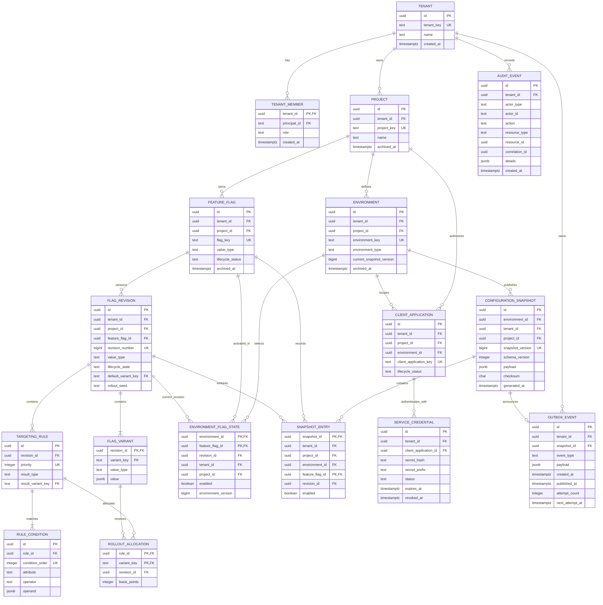

# Phase 0E PostgreSQL ERD

## Purpose

This document turns the Phase 0B domain model, Phase 0C architecture decisions, and Phase 0D contracts into a relational ownership model. It is the baseline for Phase 1 Flyway migrations, not an executable migration by itself.

Normative inputs are the [glossary](../foundation/glossary.md), [domain boundaries](../foundation/domain-boundaries.md), [invariants](../foundation/invariants.md), [state transitions](../foundation/state-transitions.md), [PostgreSQL source-of-truth ADR](../adr/ADR-005-postgresql-source-of-truth.md), [transactional outbox ADR](../adr/ADR-006-transactional-outbox-kafka.md), [immutability ADR](../adr/ADR-007-immutable-revisions-snapshots.md), [tenant authorization ADR](../adr/ADR-010-multi-tenant-authorization-boundary.md), and the [Phase 0D contracts](../../contracts/README.md).

## Modeling conventions

- Primary keys are application-generated UUIDv7 values stored as PostgreSQL `uuid`.
- Time is stored as `timestamptz` in UTC. Database values represent instants; presentation zones are external concerns.
- Mutable business rows use `created_at` and `updated_at`; immutable history uses only `created_at` or `generated_at`.
- Customer-owned descendants retain `tenant_id` even when it is derivable. Composite foreign keys make cross-tenant and cross-project references impossible at the database boundary.
- Public keys use the Phase 0D `Key` grammar and are never treated as authorization proof.
- Lifecycle values use `text` plus named `CHECK` constraints. PostgreSQL enum types are avoided so additive lifecycle changes remain deployable with ordinary migrations.
- Every foreign-key column set receives an index unless it is already the left prefix of a primary or unique key.

## Entity relationship diagram



## Aggregate and source-of-truth boundaries

| Boundary | Authoritative tables | Notes |
| --- | --- | --- |
| Identity and access | `tenants`, `tenant_members` | Principal identity comes from the identity provider; membership and role are local authorization state. |
| Configuration authoring | `projects`, `environments`, `feature_flags`, `flag_revisions`, `flag_variants`, `targeting_rules`, `rule_conditions`, `rollout_allocations` | Draft content is editable. Published revision content is immutable. |
| Publication | `environment_flag_states`, `configuration_snapshots`, `snapshot_entries` | Current selection and immutable environment-wide history are committed together. |
| Distribution administration | `client_applications`, `service_credentials` | Application identity is separate from each revocable credential. |
| Traceability and delivery | `audit_events`, `outbox_events` | Audit explains the business change; outbox carries the transactional delivery intent. |

## Tenant and project isolation

Surrogate UUIDs remain globally unique identifiers, but uniqueness is not authorization. Repository methods must begin with an authorized `tenant_id`, and child lookups must include their tenant and project scope.

The schema backs this rule with composite alternate keys and foreign keys. For example:

```sql
UNIQUE (tenant_id, id)
UNIQUE (tenant_id, project_id, id)

FOREIGN KEY (tenant_id, project_id)
  REFERENCES projects (tenant_id, id)

FOREIGN KEY (tenant_id, project_id, feature_flag_id, revision_id)
  REFERENCES flag_revisions (tenant_id, project_id, feature_flag_id, id)
```

An attacker-controlled path key can therefore never connect a Tenant A child row to a Tenant B parent row, even if application validation regresses. PostgreSQL Row-Level Security may later add defense in depth, but it is not the primary authorization mechanism in this baseline.

## Publication transaction

Every publish, rollback, enable, or disable operation uses one PostgreSQL transaction:

1. Compare-and-swap `environments.current_snapshot_version` against `expectedEnvironmentVersion` and increment it.
2. Mark the selected draft revision `PUBLISHED` when publication selects it for the first time.
3. Upsert `environment_flag_states` with the selected revision, `enabled`, and the new environment version.
4. Insert one immutable `configuration_snapshots` row and its `snapshot_entries`.
5. Insert one append-only `audit_events` row.
6. Insert one pending `outbox_events` row referencing the snapshot.
7. Commit; no Kafka operation occurs inside the transaction.

The compare-and-swap statement is the serialization point:

```sql
UPDATE environments
SET current_snapshot_version = current_snapshot_version + 1,
    updated_at = clock_timestamp()
WHERE tenant_id = :tenant_id
  AND id = :environment_id
  AND current_snapshot_version = :expected_version
RETURNING current_snapshot_version;
```

Returning no row means conflict. The transaction must then roll back without state, snapshot, audit, or outbox side effects.

## Immutability boundary

- A `DRAFT` revision and its children may be edited.
- A `PUBLISHED` revision and all children reject update and delete through database triggers in addition to service checks.
- `configuration_snapshots`, `snapshot_entries`, and `audit_events` are insert-only for application roles.
- `outbox_events` keeps immutable event identity and payload; only relay metadata such as attempts, next attempt, publication time, and last error may change.
- Rollback selects a historical published revision but always creates a new, higher snapshot version.

## JSONB boundary

JSONB is deliberately limited to values whose shape is contract-versioned or naturally extensible:

- `flag_variants.value`: typed JSON value guarded by `value_type` and `jsonb_typeof`.
- `rule_conditions.operand`: operator-specific scalar, array, or object validated before publication.
- `configuration_snapshots.payload`: immutable compiled full-snapshot document, including its top-level checksum, validated against Snapshot Schema v1 before insert. The relational checksum column must equal the document checksum.
- `audit_events.details`: non-authoritative descriptive metadata.
- `outbox_events.payload`: versioned notification payload.

Keys, lifecycle state, ownership, versions, references, timestamps, enabled state, basis points, and credential metadata remain relational columns. No baseline query depends on an unbounded JSONB scan or GIN index.
